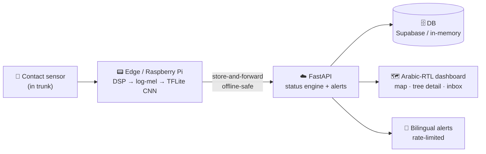
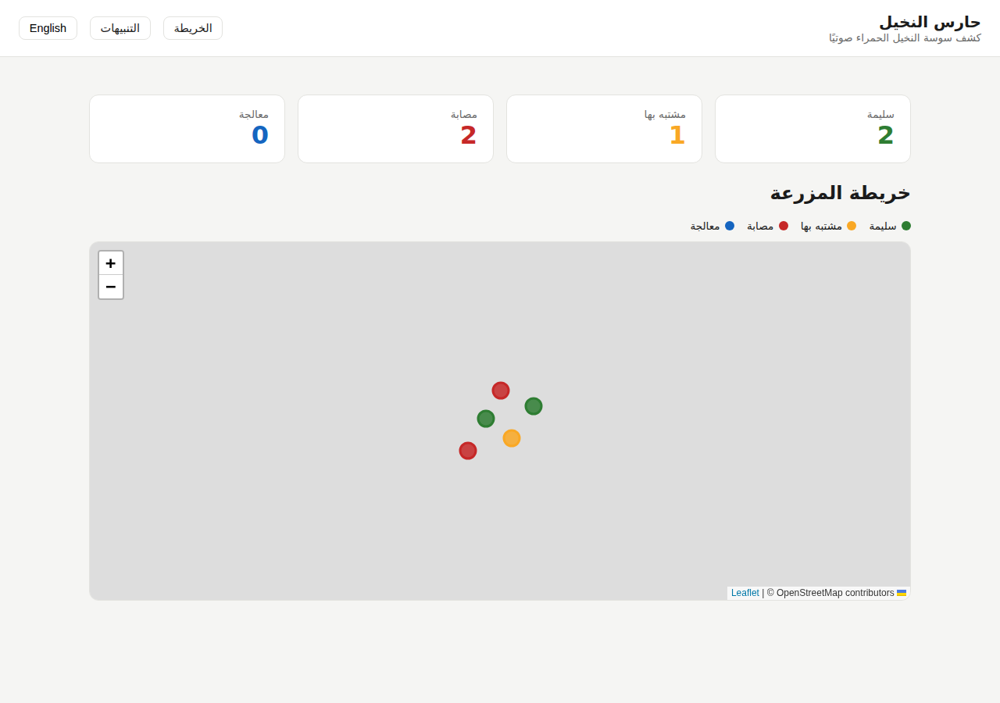
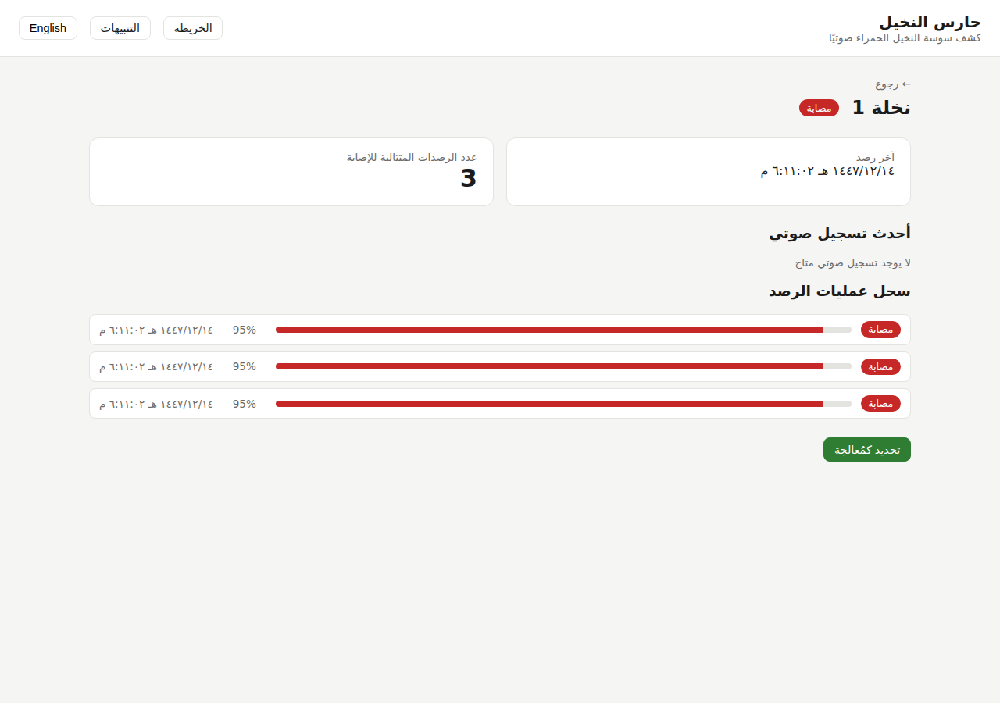
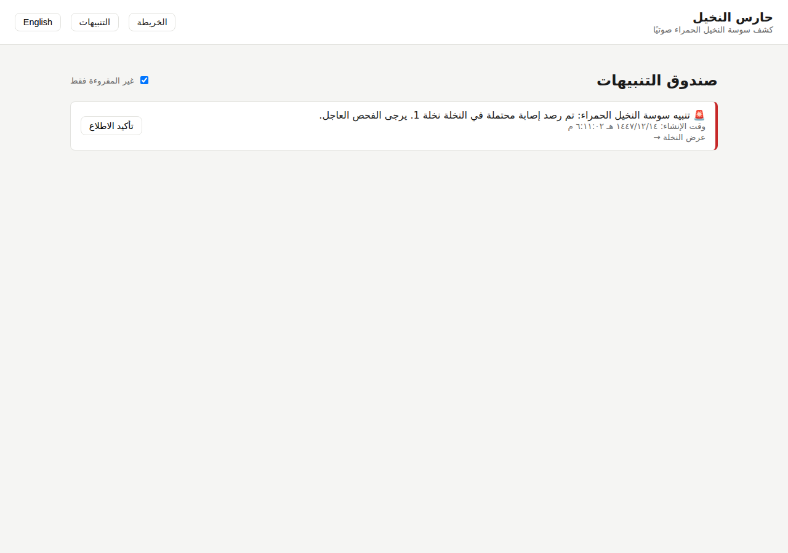

<div align="center">

# 🌴 Palm Guard — حارس النخيل

### Acoustic early-detection of Red Palm Weevil in date palms

*A contact sensor listens inside the trunk → an on-device CNN classifies the sound as `infested` or `clean` → infested trees surface on an Arabic-RTL map with alerts — **before** visible (terminal) damage appears.*


</div>

---

## The problem

Red Palm Weevil (RPW) larvae feed **hidden inside the trunk**. By the time a palm
looks sick it is usually dead — and a reservoir that re-infests the grove. But the
larvae are *audible*: short feeding bursts with energy in the **0.2–2.5 kHz** band.
Catch that early and the tree is still treatable.

> **Design priority above all else: never silently miss an infested tree.**

## How it works



## Results on real data

Trained and evaluated on the public **TreeVibes** RPW dataset, on a **held-out
*site* split** — the test trees are never seen during training, so these numbers
reflect generalisation to *new trees*, not memorised clips.

| Metric | **CNN** | Classical baseline |
|---|:---:|:---:|
| **Infested recall** | **0.926** ✓ | 0.926 |
| Infested precision | **0.595** | 0.291 |
| **PR-AUC** | **0.921** | 0.372 |
| Accuracy | **0.896** | 0.654 |

Caught **25 / 27** infested clips on unseen trees. The quantised edge model is
verified against the float model (**TFLite parity mean |Δ| = 0.025**, passed) and
the trained model ships in [`models/`](models/).

<sub>Evaluated on a held-out-site subset (7 trees · 396 clips · 0 dropped). The pipeline is dataset-agnostic and scales to the full corpus unchanged.</sub>

## The product

| Farm map (RTL) | Tree detail | Alerts inbox |
|---|---|---|
|  |  |  |
| Status-coloured pins per tree | Timeline · confidence · "mark treated" | Bilingual RPW alerts · acknowledge |

## Repository layout

| Path | What |
|---|---|
| `packages/ml` | DSP, features, dataset pipeline (site-split), baseline + CNN, TFLite export |
| `packages/api` | FastAPI backend, debounced status engine, alerts, in-memory + Supabase |
| `packages/edge` | Raspberry Pi capture → on-device inference → store-and-forward uploader |
| `packages/web` | Next.js Arabic-RTL dashboard: map, tree detail, alerts inbox |
| `models/` | Trained TreeVibes CNN: `palmguard.tflite` + metrics + parity report |
| `docs/` | `BUILD_SPEC.md` (design + science), `HARDWARE.md`, `DEPLOY.md` |
| `CLAUDE.md` | Operating rules for working in this repo |

## Quickstart

```bash
cp .env.example .env

# ML pipeline (CPU, no download needed)
make data        # synthetic RPW-like audio + manifest -> data/raw/
make baseline    # RandomForest baseline on the held-out SITE split
make test        # ml + api test suites

# Backend (in-memory DB if Supabase env is unset)
make api         # http://localhost:8000  (docs at /docs)

# Dashboard
cd packages/web && npm install && npm run dev   # http://localhost:3000

# Edge (no hardware needed): classify a clip and store-and-forward
cd packages/edge && python run.py --sim ../../some_clip.wav --once

# Full end-to-end demo (API + edge + alert)
scripts/demo.sh
```

CNN training/export need TensorFlow (`pip install tensorflow`), then
`make train && make eval && make export`.

### Train on the real TreeVibes data

TreeVibes is on Kaggle (`potamitis/treevibes`). Point the ingester at a local
copy, a Kaggle slug, or a direct URL — labelling is CSV-driven from the published
folder lists, and the **site = folder number** (one folder ≈ one tree):

```bash
export TREEVIBES_LOCAL=/path/to/extracted/treevibes   # or TREEVIBES_KAGGLE / TREEVIBES_URL
make data            # builds manifest + prints a full ingest report (0 silent drops)
make train && make eval && make export
```

## What makes it robust

- **Site-split, not clip-split** — clips from one tree never span train/test, so metrics don't lie.
- **Recall-first** — models are selected and reported on infested-recall + PR-AUC, never raw accuracy.
- **Edge-first** — inference runs on-device via TFLite with no connectivity; cloud is for storage/maps/alerts.
- **Debounced alerts** — one noisy hit can't flip a tree; N consecutive confident hits confirm; alerts are rate-limited + de-duplicated.
- **Offline-safe edge** — detections are durably queued and flushed on reconnect (no detection lost).
- **Arabic-first, bilingual** — RTL default, AR/EN throughout, even alert templates.
- **Honest data handling** — every clip is kept or counted; nothing dropped silently.

See [`docs/BUILD_SPEC.md`](docs/BUILD_SPEC.md) for the full rationale and science,
and [`CLAUDE.md`](CLAUDE.md) for contributor rules.
